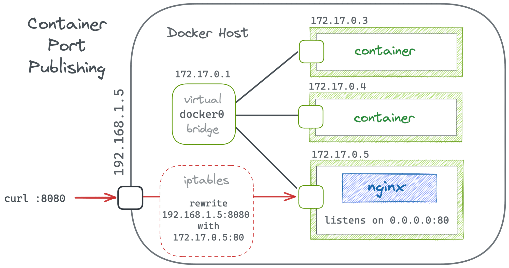

# What is a container?
Un contendor es una forma de poder empaquetar nuestras aplicaciones, con todas las
dependencias que este tenga, **incluyendo sus archivos de configuracion** 

## The container can to store:
- Archivos nodejs
- Archivos HTML
- Variables de entorno .env
- etc

# Where store the container?
Al igual que GitHub para almacenar archivos, existen aplicaciones web que almacenan contenedores
For example:
## Repositorio de contenedores 
    - Publicos (Docker Hub)
    - Privados

# What can we make with Containers?
## En desarrollo de aplicaciones
- Decargar una imagen de algun sistema operativo, por ejemplo una imagen basada en GNU Linux

### What is a Image?
Es el empaquetado que contienen las dependencias, el código y las configuraciones. Finalmente
esto es lo que se comparte y un contender es la imagen que nosotros configuramos.

Por lo tanto podemos decir más tecnicamente que un contenedor está compuesto de capas y capas de imagenes, donde la capa base por lo general es una distribución GNU Linux, la imagen  de GNU Linux más 
común es Alpine.

# Get started with Docker
## Comandos sobre las imagenes
 > Descargar una imagen:
```sh
$ docker pull [OPTIONS] <IMAGE>
```
> Ver las imagenes descargadas:
```sh
$ docker images
$ docker images [OPTIONS] <IMAGE>
```
> Eliminar una imagen
```sh
$ docker image rm <IMAGE>
```
---
## Comandos sobre los contenedores
> Crear un contenedor a partir de una imagen ya disponible:
```sh
$ docker create <IMAGE>
```
> Iniciar un contenedor que ha sido detenido
```sh
$ docker start <HASH_CONTAINER>     # or <NAME_CONTAINER>
```
> Detener un contenedor
```sh
$ docker stop <HASH_CONTAINER>      # or <NAME_CONTAINER>
```
> Eliminar el contenedor creado
```sh
$ docker rm <HASH_CONTAINER>      # or <NAME_CONTAINER>
```

Con este enfoque, nosotros tenemos que usar el hash gigante y poco eficiente para codficarlo. Sin embargo docker nos da la posibilidad de crear una referencia a dicha imagen, asi como los nombres de 
repositorios remotos en Git. De esta manera, en cada operación que querramos hacer con esta imagen, solo usamos la **referencia**

> Crear un contenedor con una referencia
```sh
$ docker create --name <NAME_CONTAINER> <IMAGE>
```

### Estados de los contenedores
> Muestra los contenedores en ejecución
```sh
$ docker ps 
```
> Muestra los contenedores creados y en ejecución
```sh
$ docker ps -a
```
> Muestra los registros de un contenedor especifico
```sh
$ docker logs  <NAME_CONTAINER>
$ docker logs --follow <NAME_CONTAINER>
```

### Comando triple acción
> Descarga la imagen si es que no esta disponible, crear un contenedor en base a la imagen e inicia dicho contenedor
```sh
$ docker run <IMAGE>
$ docker run -d <IMAGE>         # -d -> background run
$ docker run --name <NAME_CONTAINER> <IMAGE> 
$ docker run --name <NAME_CONTAINER> -d <IMAGE> 
```

# Questions
1. Por qué cuando creo e inicio manualmente un contenedor con una imagen de ubuntu:20.04, el contenedor se inicia y se detiene inmediatamente.

2. Por qué al crear e iniciar dicho contenedor con el comando 'run' y pasandole la opcion -it recien el contenedor comienza y no se detiene inmediatamente.

3. Si partimos de la idea de que al hacer manual el inicio del contenedor, nosotros no estamos pasando ningún proceso al contenedor y es por ello que se detiene inmediatamente. Entonces por qué cuando detengo el contenedor y lo deseo iniciar nuevamente, y lo hago con el comando 'start' recien ahora pasa que el contenedor no se detiene inmediatamente.

# Port Mapping
Docker utiliza un modelo de red en el que los contenedores se ejecutan en su propia red aislada. Por defecto, los contenedores no pueden ser accedidos desde fuera de esta red aislada

Si alguna aplicación dentro de tu contenedor necesita ser accesible desde fuera de este, necesitas especificar explícitamente qué puertos del contenedor deben ser mapeados a puertos en la máquina host.

Entonces podemos decir que cualquier conexión o solicitud que llegue al puerto 'x' de la maquina host, será mapeada al puerto 'y' del contenedor.



---
> Crear un contenedor con por mapping
```sh
$ docker create -p <PORT_HOST_MACHINE>:<PORT_CONTAINER> --name <NAME_CONTAINER> <IMAGE>
```
